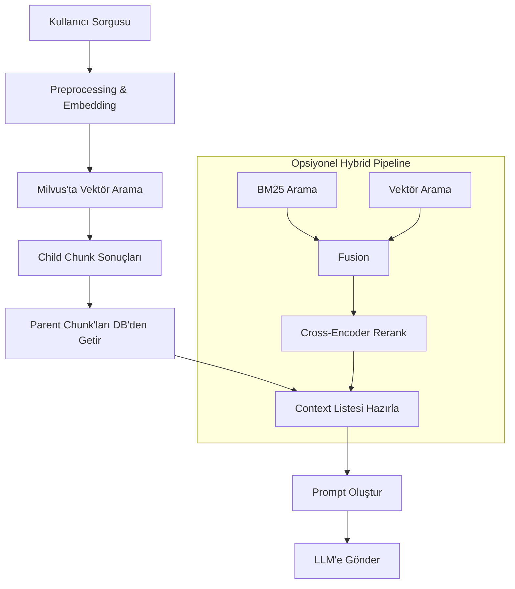

# Hyperion

Hyperion, kullanıcıların belge yükleyip, bu belgelerden LLM (Large Language Model) destekli, bağlama duyarlı yanıtlar alabileceği, modüler ve ölçeklenebilir bir platformdur.

## Proje Amacı

Karmaşık ve büyük belge koleksiyonlarından, LLM destekli, güncel ve bağlama duyarlı bilgiye hızlıca erişim sağlamak için geliştirilmiştir. Model bazlı bilgi havuzları ve belge tabanlı sohbet deneyimi sunar.

**RAG Pipeline Genel Akışı:**
- Kullanıcıdan gelen sorgu embedding'e dönüştürülür.
- Milvus vektör veritabanında en yakın chunk'lar bulunur.
- Chunk'ların parent başlık ve içerikleri veritabanından çekilir.
- Bağlam listesi hazırlanır ve LLM'e prompt olarak sunulur.
- (Opsiyonel) Hybrid search ile BM25 + vektör arama birleştirilebilir, cross-encoder ile yeniden sıralama yapılabilir.

---

## Kullanılan Teknolojiler

- **Backend:** Python 3.10+, FastAPI
- **Frontend:** React, Redux
- **Veri Tabanı:** PostgreSQL
- **Vektör Veritabanı:** Milvus
- **Önbellek:** Redis
- **Otomasyon:** Apache Airflow
- **Dağıtım:** Docker, docker-compose, Kubernetes
- **LLM/Embedding:** Sentence Transformers, OpenRouter API
- **CI/CD ve İzleme:** Prometheus, Grafana, ELK, pytest, pytest-asyncio, pytest-cov

---

## Kurulum

### 1. Gereksinimler
- Docker & Docker Compose
- (Opsiyonel) Python 3.10+ ve pip (geliştirici modu için)

### 2. Ortam Değişkenleri
`.env` veya `.env.test` dosyası ile veritabanı, Redis, JWT, API key gibi değişkenler tanımlanmalı.

### 3. Docker ile Kurulum
```sh
docker-compose up --build
```

### 4. Test Ortamı (İzole)
```sh
docker-compose -f docker-compose.test.yml up --abort-on-container-exit
```

### 5. Migration ve İlk Kurulum
- Veritabanı migration'ları otomatik başlatılır.
- Test ortamında `hyperion_test` veritabanı oluşmazsa, elle oluşturulmalı veya migration scripti çalıştırılmalı.

### 6. Testler
```sh
docker-compose -f docker-compose.test.yml up --abort-on-container-exit
```

---

## Kullanım & API Detayları

### Kimlik Doğrulama & API Key
Bazı endpoint'ler için API key gereklidir.

```
Authorization: Bearer <API_KEY>
```

### Temel API Endpoint'leri

#### 1. Belge Yükleme
- **POST /upload**
- PDF/TXT dosyası yükler, otomatik parse ve embedding başlatılır.
- Örnek cURL:
```sh
curl -X POST http://localhost:8000/upload \
  -H "Authorization: Bearer <API_KEY>" \
  -F "file=@/path/to/document.pdf"
```

#### 2. Model Yönetimi
- **POST /model/create**
```json
{
  "model_name": "test_model",
  "model": "test",
  "system_prompt": "test"
}
```
- **GET /models**

#### 3. Sohbet
- **POST /chat**
- **GET /chats**

#### 4. Embedding & Arama
- **POST /embedding/embed**
- **POST /embedding/search**

**RAG Arama Pipeline'ı Teknik Akışı:**
1. Kullanıcı sorgusu normalize edilip embedding'e dönüştürülür.
2. Milvus'ta vektör arama ile en yakın child chunk'lar bulunur.
3. Parent chunk'lar veritabanından çekilir, başlık ve içerik eklenir.
4. Bağlam listesi hazırlanır ve LLM'e prompt olarak sunulur.
5. (Opsiyonel) Hybrid search: BM25 + vektör arama + fusion + cross-encoder ile yeniden sıralama.



#### 5. Healthcheck
- **GET /api/health**

---

## Projenin Mevcut Durumu

### Çalışanlar
- Backend API ve temel endpoint'ler (sohbet, belge yükleme, model yönetimi, healthcheck)
- Frontend temel iskeleti
- Milvus, Redis, PostgreSQL entegrasyonları
- File parsing pipeline'ı (PDF ve TXT desteği)
- **RAG pipeline ile embedding tabanlı ve hybrid arama desteği**
- Otomatik test altyapısı (pytest, docker-compose.test.yml)
- API key ile korunan endpointler ve dosya yükleme için otomatik testler

### Eksikler & Bilinen Sorunlar
- File parsing pipeline'ına yeni dosya tipleri (DOCX vb.) eklenmeli
- Doküman-model ilişki tablosu ve model bazlı vector query desteği eksik
- Gelişmiş test altyapısı ve kapsamlı testler
- Kullanıcı arayüzünde detaylı özellikler
- Otomasyon ve izleme altyapısının tam entegrasyonu
- Milvus ve etcd bağlantı stabilitesinin uzun süreli izlenmesi
- Büyük belge işleme ve embedding'de performans optimizasyonu gerekebilir
- Test runner imajında yeni bağımlılıklar eklendiğinde build alınmalı
- PostgreSQL test veritabanı otomatik oluşmazsa migration veya manuel kurulum gerekebilir

---

## Yol Haritası & Sonraki Adımlar

- File parsing pipeline'ına yeni dosya tipleri (DOCX vb.) eklenmesi
- Doküman-model ilişki tablosu ve model_id ile embedding ekleme/query desteği
- Milvus ve etcd bağlantı stabilitesinin izlenmesi
- Servisler arası iletişim ve veri akışının manuel/otomatik testlerle doğrulanması
- Test runner ve build süreçleri için CI/CD entegrasyonunun güçlendirilmesi
- Gerekirse docker-compose ve migration süreçlerinde ek iyileştirme yapılması

---

## Katkı ve İletişim

Her türlü katkı, hata bildirimi ve öneri için lütfen GitHub Issues veya Pull Request açın.
