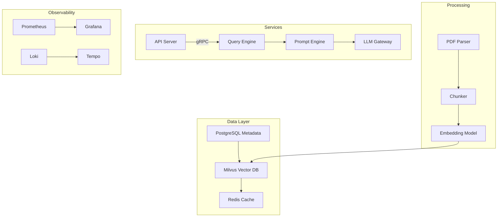

# Hyperion RAG Application Architectural Plan

## 1. Structured TODO List

### Backend (P0)
- [ ] Implement Milvus/FAISS integration (current main.py has placeholder)
- [ ] Add RBAC middleware (JWT implementation missing)
- [ ] Complete OpenRouter/LMStudio connector error handling

### Frontend (P1)  
- [ ] Build model configuration interface (React components)
- [ ] Implement query history tracking
- [ ] Add response validation UI

### DevOps (P0)
- [ ] Create GitHub Actions pipeline (missing in current setup)
- [ ] Implement Helm chart validation tests
- [ ] Configure auto-scaling rules for Kubernetes

### Security (P1)
- [ ] Add encryption for uploads directory
- [ ] Implement audit logging framework
- [ ] Create secrets management strategy

## 2. Technical Architecture Update



## 3. Documentation Suite Structure

```
docs/
├── installation/
│   ├── local_development.md
│   ├── production_setup.md
│   └── helm_values_reference.md
├── api/
│   ├── openapi.yaml
│   └── client_sdk_examples/
├── architecture/
│   ├── service_topology.md
│   └── data_flows.md
└── operations/
    ├── monitoring_guide.md
    └── disaster_recovery.md
```

## Next Steps:
1. Implement core Milvus integration
2. Build RBAC middleware
3. Create CI/CD pipeline