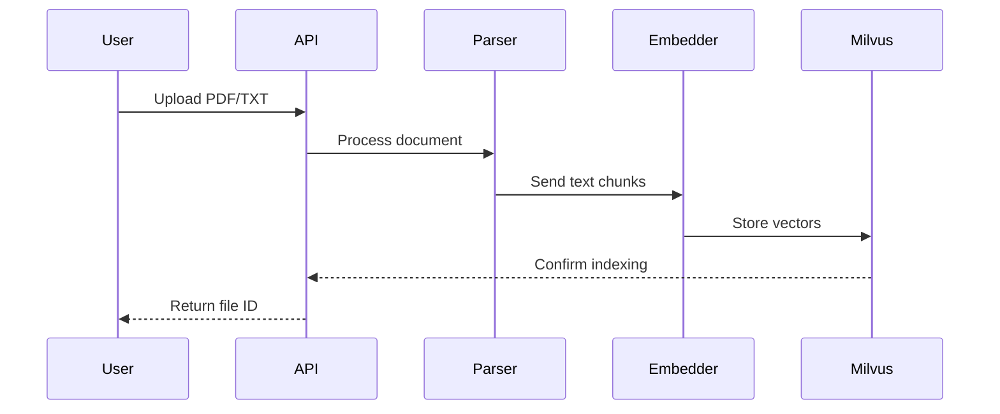

# Data Flow Specifications

## Ingestion Pipeline


## Query Processing
```mermaid
sequenceDiagram
    participant User
    participant API
    participant QueryEngine
    participant Milvus
    participant LLM

    User->>API: Submit query
    API->>QueryEngine: Process request
    QueryEngine->>Milvus: Semantic search
    Milvus-->>QueryEngine: Return context
    QueryEngine->>LLM: Generate response
    LLM-->>API: Formatted answer
    API-->>User: Final response