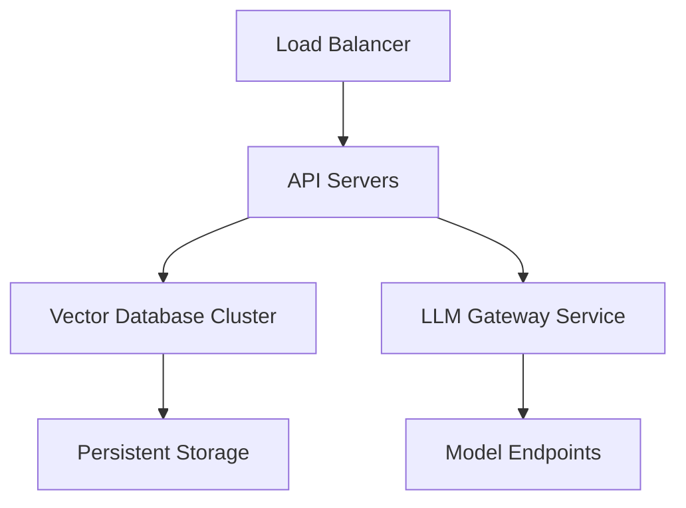

# Monitoring Infrastructure Requirements

## Prometheus Configuration
- Endpoint: ${PROMETHEUS_ENDPOINT}
- Authentication: Bearer token via PROMETHEUS_TOKEN environment variable
- Minimum scrape interval: 5 seconds

## OpenTelemetry Collector
- OTLP endpoint: ${OTEL_EXPORTER_OTLP_ENDPOINT}
- Required receivers:
  - otlp
  - prometheus
- Required processors:
  - batch
  - memory_limiter

## Service Level Objectives
- API availability: 99.9% over 5 minute window
- Max latency p99: 500ms
- Error budget: 0.1% per hour

## Alerting Rules
- HTTP error rate > 5% for 2 minutes
- Pending pods > 3 for 5 minutes
- CPU utilization > 80% for 5 minutes
# Infrastructure Requirements

## Minimum Production Deployment

## Scaling Strategy
| Component         | Horizontal Scaling | Vertical Scaling | Notes                          |
|--------------------|--------------------|------------------|--------------------------------|
| API Servers        | ✅ Auto-scale group | ❌              | Stateless architecture         |
| Vector Database    | ✅ Sharding        | ✅ Memory        | Requires sticky sessions       |
| LLM Gateway        | ✅ Pod replicas    | ✅ GPU nodes     | Kubernetes node selectors      |

## Monitoring Stack
