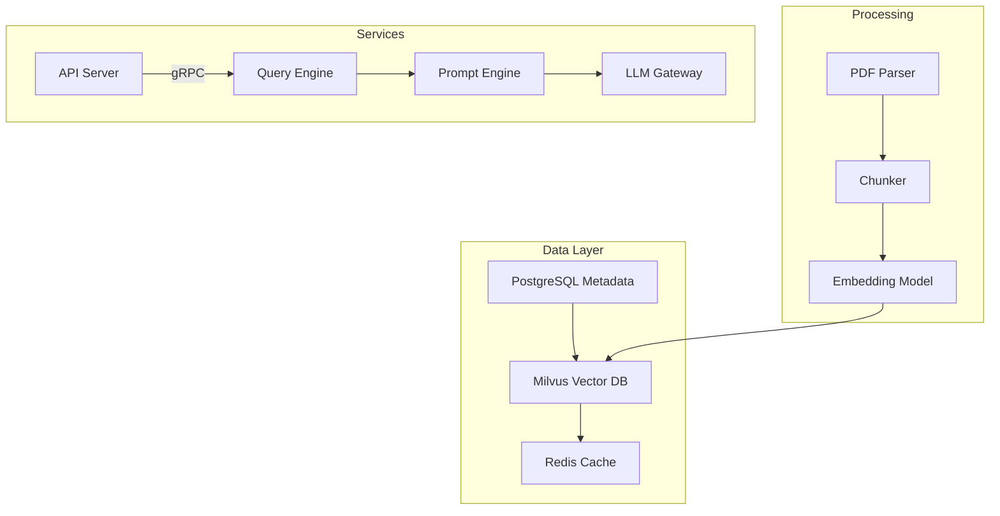

# Service Topology Overview

## Core Components

## Interaction Matrix
| Service          | Protocol | Port  | Dependency          |
|------------------|----------|-------|---------------------|
| API Server       | HTTP/2   | 8000  | Query Engine        |
| Query Engine     | gRPC     | 50051 | Milvus, Redis       |
| LLM Gateway      | HTTP/1.1 | 8080  | External LLM APIs   |
| Milvus           | gRPC     | 19530 | -                   |