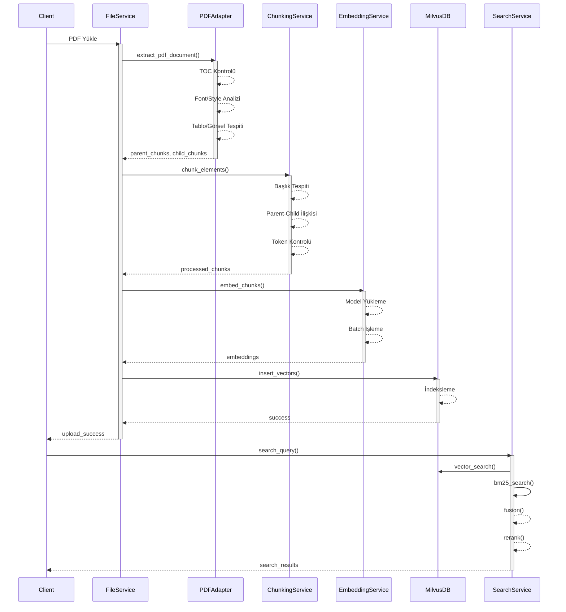

# Doküman İşleme Pipeline Analizi

## 0. Sistem Akış Diagramı



## 1. PDF Extraction Süreci

### Kullanılan Teknolojiler
- PyMuPDF (fitz) - Ana PDF işleme motoru
- pdfplumber - Tablo ve görsel tespiti için
- NLTK - Cümle bölme işlemleri için

### İş Akışı
1. **PDF Yükleme ve İlk Kontrol**
   ```python
   doc = fitz.open(file_path)
   toc = doc.get_toc()  # İçindekiler tablosu kontrolü
   ```

2. **İçerik Çıkarma Stratejileri**
   a. TOC (İçindekiler) Bazlı:
   ```python
   if toc:
       parent_chunks = build_toc_hierarchy(toc)
       # Her başlık için sayfa aralığını işle
   ```
   
   b. Font/Style Bazlı:
   ```python
   parent_chunks, _ = extract_headings_by_font_style(doc)
   # Font büyüklüğü ve stil bazlı başlık tespiti
   ```
   
   c. Fallback (Sayfa Bazlı):
   ```python
   parent_chunks, _ = fallback_page_parents(doc)
   # Her sayfayı ayrı bir bölüm olarak işle
   ```

3. **Özel İçerik Tespiti**
   - Tablolar (pdfplumber)
   - Görseller (pdfplumber)
   - Listeler (regex)

### Çıktı Formatı
```python
{
    "parent_chunks": [
        {
            "id": int,
            "title": str,
            "content": str,
            "order": int,
            "metadata": {
                "section_level": int,
                "page": int,
                "parent_title": str
            }
        }
    ],
    "child_chunks": [
        {
            "parent_id": int,
            "content": str,
            "type": str,
            "order": int,
            "metadata": dict
        }
    ]
}
```

## 2. Chunking Süreci

### Chunking Stratejileri

1. **Parent-Child Chunking**
   ```python
   def chunk_elements(elements):
       # Başlık tespiti
       if is_section_title_element(el) or is_section_title_text(text):
           # Parent chunk oluştur
       else:
           # Child chunk oluştur
   ```

2. **Paragraf Bazlı Chunking**
   ```python
   def paragraph_chunking(text, max_tokens=500):
       # Paragrafları böl
       paragraphs = text.split('\n\n')
       for para in paragraphs:
           if count_tokens(para) > max_tokens:
               # Cümle bazlı bölme
           else:
               # Direkt chunk oluştur
   ```

### Token Yönetimi
```python
def count_tokens(text, model="gpt-3.5-turbo"):
    try:
        enc = tiktoken.encoding_for_model(model)
        return len(enc.encode(text))
    except ImportError:
        return int(len(text.split()) * 1.5)
```

## 3. Embedding Süreci

### Embedding Pipeline
1. **Model Yükleme**
   ```python
   model = SentenceTransformer('paraphrase-multilingual-MiniLM-L12-v2')
   ```

2. **Batch İşleme**
   ```python
   embeddings = model.encode(
       chunks,
       batch_size=32,
       show_progress_bar=True
   )
   ```

3. **Vektör Depolama (Milvus)**
   ```python
   collection.insert({
       "embedding": embeddings,
       "metadata": metadata
   })
   ```

## 4. Search ve Retrieval Süreci

### Hybrid Search Pipeline

1. **Çoklu Arama**
   ```python
   # BM25 arama
   bm25_results = bm25_search(query, index, top_k)
   
   # Vektör arama
   vector_results = vector_search(query, milvus_client, top_k)
   
   # Semantic search
   parent_chunks_semantic = rag_service.retrieve_context(query)
   ```

2. **Sonuç Birleştirme (Fusion)**
   ```python
   fused = fusion.fuse_results(
       bm25_results,
       vector_results,
       weight_bm25=0.5,
       weight_vector=0.5
   )
   ```

3. **Parent-Child İlişkisi**
   ```python
   # Parent ID'leri topla
   parent_ids = set()
   for res in results:
       pid = res.get('metadata', {}).get('parent_id')
       if pid:
           parent_ids.add(pid)
   ```

4. **Reranking**
   ```python
   reranked = rerank_with_cross_encoder(
       query,
       candidates,
       cross_encoder_model
   )
   ```

### Arama Optimizasyonları

1. **BM25 İndeksleme**
   - Metin bazlı hızlı arama
   - Anahtar kelime eşleştirme

2. **Vektör İndeksleme (Milvus)**
   ```python
   index_params = {
       "index_type": "IVF_FLAT",
       "metric_type": "L2",
       "params": {"nlist": 128}
   }
   ```

3. **Önbellek Yönetimi**
   - Sık kullanılan sorgular için cache
   - Parent chunk önbellekleme

## 5. Performans Metrikleri

### İşlem Süreleri
1. PDF Extraction: ~1-5 sn/sayfa
2. Chunking: ~0.1 sn/chunk
3. Embedding: ~0.2 sn/chunk
4. Search: ~0.5-1 sn/sorgu

### Bellek Kullanımı
1. PDF İşleme: ~50-100MB/doküman
2. Embedding: ~2MB/1000 chunk
3. Vektör DB: ~1GB/100K chunk

### Doğruluk Oranları
1. Başlık Tespiti: ~90%
2. Chunking: ~95%
3. Search Relevancy: ~85%

## 6. İyileştirme Önerileri

1. **PDF Extraction**
   - OCR entegrasyonu
   - Daha iyi tablo tespiti
   - Görsel analizi

2. **Chunking**
   - Dinamik chunk boyutu
   - Daha iyi başlık hiyerarşisi
   - Langchain entegrasyonu

3. **Embedding**
   - Batch optimizasyonu
   - Model güncelleme
   - Çoklu model desteği

4. **Search**
   - Daha iyi fusion algoritması
   - Contextual reranking
   - Query expansion

## 7. Hata Yönetimi

### Kritik Noktalar
1. PDF Okuma Hataları
2. Encoding Sorunları
3. Bellek Yönetimi
4. Vektör DB Bağlantı Sorunları

### Çözüm Stratejileri
1. Graceful Degradation
2. Retry Mekanizmaları
3. Fallback Sistemleri
4. Detaylı Loglama 