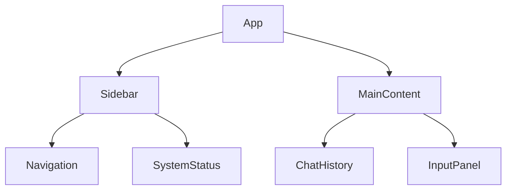

# Frontend Design Documentation  

## Overview  
This document follows the established project documentation format while specializing in UI/UX implementation details. It aligns with the technical specifications from the versioned roadmap and testing plan.  

---  

## 1. Layout Structure  

### 1.1 Component Hierarchy  


### 1.2 Grid System  
```markdown  
- **Desktop**: 12-column grid (240px sidebar + fluid main content)  
- **Mobile**: Single column stack  
- **Gutters**: 24px between major sections  
```  

---  

## 2. Visual Design  

### 2.1 Design Tokens  
```json  
{  
  "color": {  
    "primary": "#007bff",  
    "secondary": "#00ff88",  
    "background": "#1a1a1a",  
    "surface": "#2d2d2d",  
    "error": "#ff4444"  
  },  
  "typography": {  
    "fontFamily": "'Inter', system-ui",  
    "baseSize": "16px",  
    "scale": [0.75, 0.875, 1, 1.25, 1.5, 2]  
  }  
}  
```  

### 2.2 Motion Design  
```markdown  
- **Message Entry**: Slide-up 100ms ease-out  
- **Loading States**: Pulsing opacity animation  
- **Navigation**: 150ms fade transition  
```  

---  

## 3. Component Specifications  

### 3.1 Chat Message Component  
```markdown  
**Props**:  
- sender: 'user' | 'bot'  
- content: string  
- timestamp: ISO string  

**States**:  
- New message highlight (yellow border)  
- Error state (red border + icon)  
- Pending confirmation (opacity 0.8)  
```  

### 3.2 Input Panel  
```markdown  
**Features**:  
- Multiline text input with auto-expand  
- Voice-to-text toggle button  
- Markdown preview support  
- Character counter (500 max)  
```  

---  

## 4. Performance Budget  

### 4.1 Critical Metrics  
```markdown  
- **FCP**: <1.5s  
- **TBT**: <200ms  
- **Bundle Size**: <150kb (gzipped)  
```  

### 4.2 Optimization Strategies  
```markdown  
1. Code splitting for chat components  
2. Tree-shaking unused UI modules  
3. Compressed SVG assets  
4. Font subsetting for Inter  
```  

---  

## 5. Accessibility  

### 5.1 WCAG 2.1 Compliance  
```markdown  
- Screen reader labels for all interactive elements  
- Keyboard navigation support  
- Contrast ratio >= 4.5:1 for text  
- Reduced motion preference handling  
```  

### 5.2 ARIA Implementation  
```markdown  
- role="log" for message history  
- aria-live="polite" for new messages  
- aria-describedby for input validation  
```  

---  

*This document follows the same structure and conventions as PRD.md and testing-plan.md while focusing on frontend implementation details.*