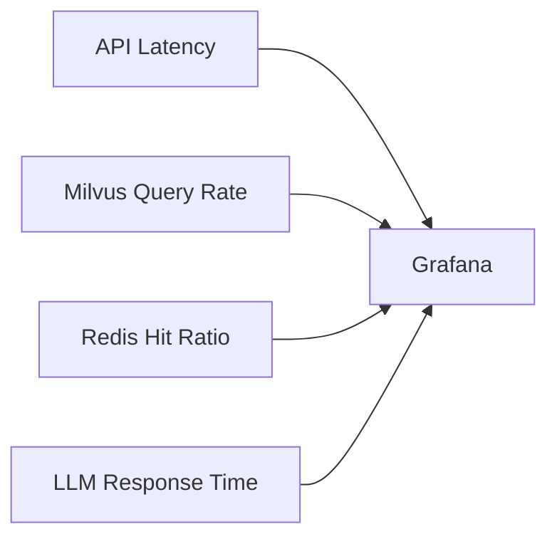

# Monitoring and Observability Guide

## Stack Components
- Prometheus (Metrics)
- Grafana (Dashboards)
- Loki (Logs)
- Tempo (Traces)

## Key Metrics


## Alert Examples
```yaml
# prometheus/alerts.yml
groups:
- name: api-alerts
  rules:
  - alert: HighAPIErrorRate
    expr: sum(rate(http_requests_total{status=~"5.."}[5m])) / sum(rate(http_requests_total[5m])) > 0.05
    for: 10m
    labels:
      severity: critical
    annotations:
      summary: High error rate on API endpoints