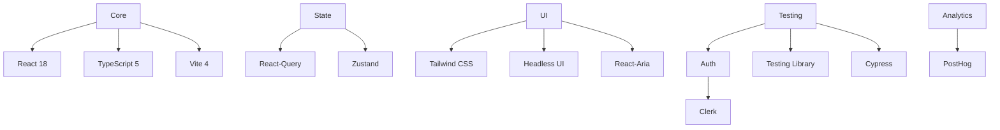
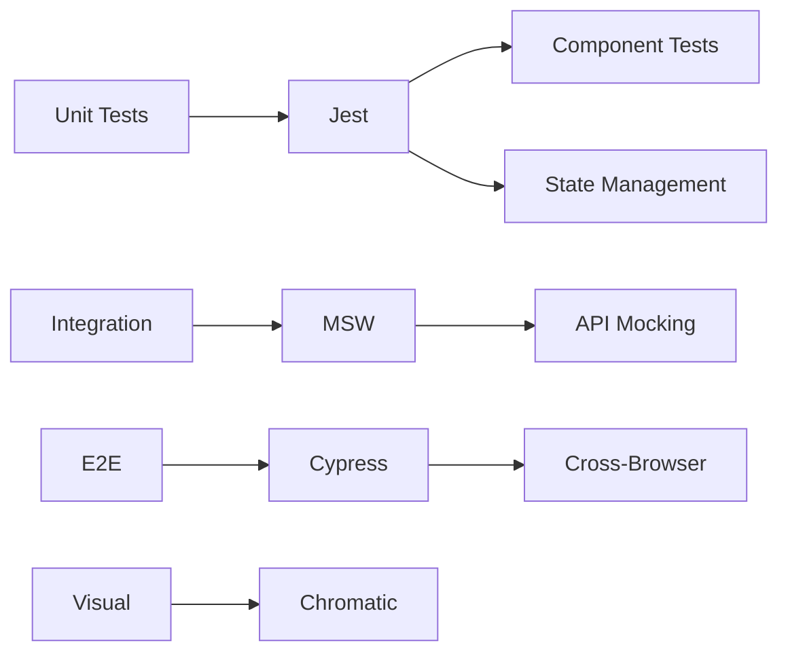
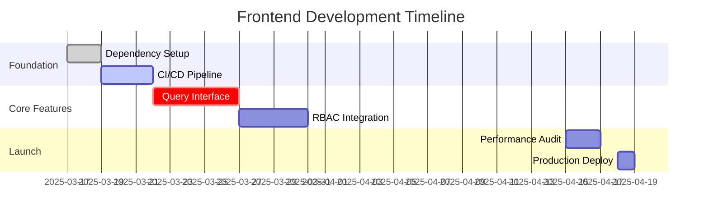

# Hyperion Frontend Development Initiation Plan

## 1. Current State Analysis
- **Codebase Maturity**: Basic React/TS setup (v18) without advanced patterns
- **Critical Gaps**:
  - State management (React-Query missing)
  - UI framework (Tailwind CSS not implemented)
  - Testing (No Jest/Cypress configuration)
  - Monitoring (OpenTelemetry frontend integration)(Will Developed in Monitoring Phase)

## 2. Technology Stack


## 3. Implementation Phases

### Phase 1: Foundation Setup (Days 1-7)
1. **Dependency Overhaul**:
   - Add React-Query, Tailwind, Jest
   - Migrate from CRA to Vite
   ```bash
   npm install @tanstack/react-query zustand tailwindcss postcss autoprefixer jest @testing-library/react @testing-library/jest-dom cypress
   ```

2. **Component Architecture**:
   ```tsx
   // src/components/ModelConfigForm.tsx
   import { useQuery } from '@tanstack/react-query';

   interface ModelConfig {
     temperature: number;
     maxTokens: number;
   }

   export const ModelConfigForm = () => {
     const { data } = useQuery<ModelConfig>(['model-config']);
     // Form implementation
   }
   ```

### Phase 2: Core Implementation (Days 8-21)
| Feature          | Tech Stack       | Integration Points       |
|------------------|------------------|--------------------------|
| Query History     | React-Table      | Backend API (gRPC)       |
| RBAC Interface    | Clerk Components | JWT Middleware           |
| Response Validation | JSON Schema    | OpenAPI Spec Validation  |

### Phase 3: Performance Optimization (Days 22-28)
- **Targets**:
  - LCP < 1.2s
  - CLS < 0.1
  - FID < 100ms
  
- **Strategies**:
  - Code splitting via React.lazy()
  - SWR caching policies
  - Web Worker-based PDF parsing

## 4. QA/Testing Protocol


## 5. Risk Mitigation
| Risk Area         | Mitigation Strategy                  | Owner       |
|--------------------|--------------------------------------|-------------|
| Backend API Changes| Contract Testing via PactJS          | FE Team     |
| Legacy CSS Conflicts| Shadow DOM Component Isolation      | UI Engineer |
| Browser Support    | Progressive Enhancement Strategy     | QA Lead     |

## 6. Metrics & Milestones


## 7. Collaboration Workflow
1. **Design Handoff**:
   - Figma → Storybook via Figma API
   - Design Token Sync with Tailwind

2. **API Contract Process**:
   ```bash
   npm run generate-types --api-spec=../docs/api/openapi.yaml
   ```

## 8. Compliance Requirements
- WCAG 2.1 AA Compliance
- GDPR Data Request Handling
- CSP Header Configuration