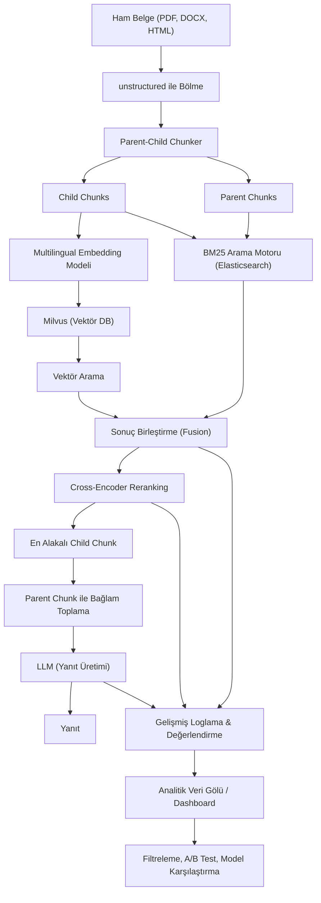

# Uzun Vadeli Hibrit Arama & Gelişmiş RAG Değerlendirme Mimarisi

```mermaid
flowchart TD
    A["Ham Belge (PDF, DOCX, HTML)"] --> B["unstructured ile Bölme"]
    B --> C["Parent-Child Chunker"]
    C --> D["Parent Chunks"]
    C --> E["Child Chunks"]
    E --> F["Multilingual Embedding Modeli"]
    F --> G["Milvus (Vektör DB)"]
    D & E --> H["BM25 Arama Motoru (Elasticsearch)"]
    G --> I["Vektör Arama"]
    H --> J["Sonuç Birleştirme (Fusion)"]
    I --> J
    J --> K["Cross-Encoder Reranking"]
    K --> L["En Alakalı Child Chunk"]
    L --> M["Parent Chunk ile Bağlam Toplama"]
    M --> N["LLM (Yanıt Üretimi)"]
    N --> O["Yanıt"]
    J --> P["Gelişmiş Loglama & Değerlendirme"]
    K --> P
    N --> P
    P --> Q["Analitik Veri Gölü / Dashboard"]
    Q --> R["Filtreleme, A/B Test, Model Karşılaştırma"]
``` 